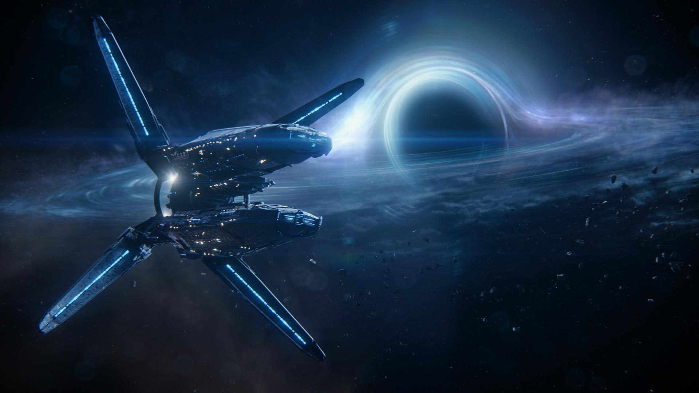

# SpaceshipSimulator

### Una aventura espacial
#### El objetivo del proyecto SpaceshipSimulator es que el usuario por medio de un menú pueda crear una nave espacial,ver su nave espacial, acelerar, frenar, parar, gestionar su bodega y salir de ella.

1. Cuando el usuario escoja opción de crear una nave espacial el podrá personalizar su nave espacial colocando los
  siguientes atributos:
   * **Nombre**
   * **Matricula Galáctica**
   * **Aceleración**

2. Cuando el usuario coloque su aceleración se podrá calcular la velocidad y la posicion actual de la nave.
    * [Explicacion de la clase SpaceShip](./docs/SpaceShip.md)

3. El usuario también tendrá una opción donde muestra su nave espacial por medio de AsciiArt
   * [Ejemplos](https://www.asciiart.eu/space/spaceships)

4. El usuario podrá hacer que la nave frene aplicando la misma aceleración pero en sentido contrario.

5. Tambien podra hacer una parada de emergencia (no se recomienda)

6. El usuario podrá ver la capacidad de carga máxima que tendrá su nave espacial (el número
  de containers máximos que puede transportar.)
   * [Explicacion de la clase Cargo](./docs/Cargo.md)

7. Tambien podra añadir containers a la bodega de la nave espacial, si no hay mas espacio el robot de la nave espacial
  le avisara con un mensaje

8. Tambien podra quitar containers a la bodega de la nave espacial, si no hay mas containers el robot de la nave              espacial le avisara con un mensaje

9. El usuario tendrá una opción de salir de la nave espacial (mala idea)

