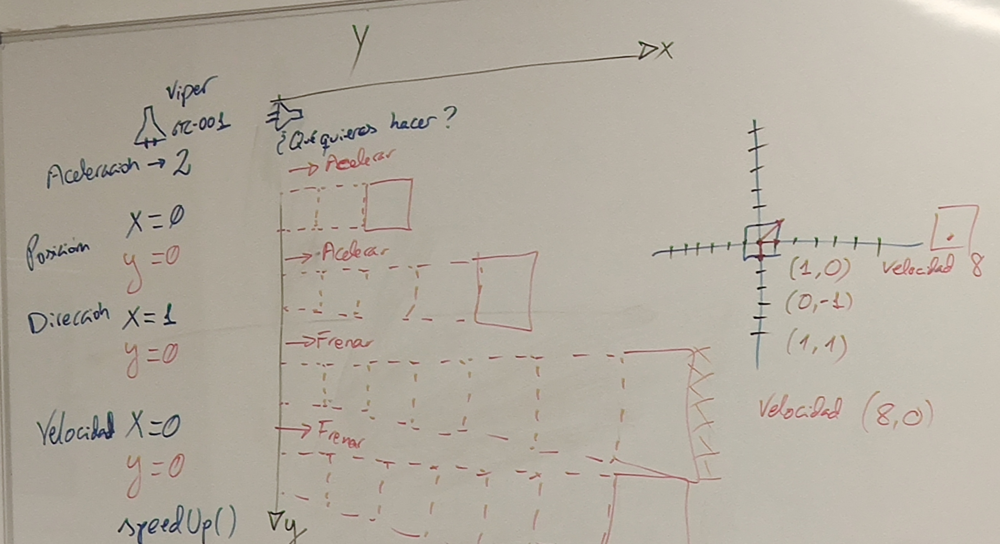

# Clase SpaceShip

En esta clase es donde se crea la nave espacial y se calcula con un metodo 
llamado SpeedUp la velocidad y la posicion de la nave espacial 

SpeedUp() = Este metodo funciona para calcular la velocidad y la posicion de la nave espacial
por medio de la aceleracion 

#### calculoVelocidad = aceleracion += aceleracion2;
#### resultadoVelocidad = calculoVelocidad += velocidadX;
#### calculoPosicion = coordenadaX =+ resultadoVelocidad;

brake() = Este metodo funciona para que la nave espacial pueda frenar (Puede ir en reversa)
#### resta = resultadoVelocidad -= aceleracionBrake
(resultado del calculo de la velocidad del metodo SppedUp -= el numero que quiere restar el usuario)

emergencyStop () = Este metodo sirve para que la nave espacial pueda tener una parada de emergencia
(Su velocidad queda en 0)

Para calcular la velocidad y la posicion mire estas paginas web 
* [Aleph](https://aleph.org.mx/cual-es-la-formula-para-calcular-la-velocidad#:~:text=Velocidad%20%3D%20Distancia%20%2F%20Tiempo%20%3D%20V%3DD%2FT.)
* [Khan Academy](https://es.khanacademy.org/science/physics/one-dimensional-motion/displacement-velocity-time/v/calculating-average-velocity-or-speed)
* [Juegos Infatiles](https://juegosinfantiles.bosquedefantasias.com/matematicas/como-calcular-velocidad-aceleracion)
* [Khan Academy Español](https://www.youtube.com/watch?v=FrQAtqBras4)

Tambien en un boceto del profesor : D

[Volver](../README.md)